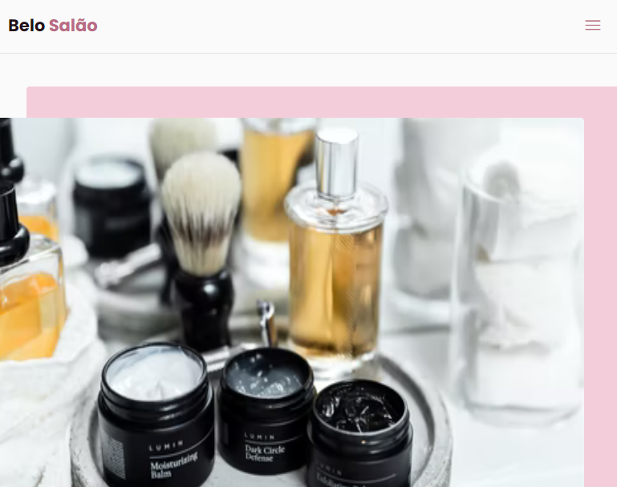

# projeto_salao
Esse projeto é um site para desktop e mobile para apresentação de salões de beleza, ele foi construído no evento NLW_ORIGIN ministrado pela empresa rocketseat.

## Minha aplicação versão desktop:

## Minha aplicação versão mobile:

## Sobre a aplicação:

Como já apresentado o site foi construído para simular duas versões: desktop para tamanhos de tela superiores a 1200 px e a mobile para tamanhos 
de tela inferiores a 1200 px, isso foi feito, por meio de media queries, existe a possibilidade para tornar essa aplicação ainda mais responsiva e 
a adequar para outros tamanhos de tela, usando essa mesma estratégia.

O site possui um menu fixo com links de acesso para cada sessão do site e um botão de voltar ao topo, a medida que o usuário navega pelas sessões 
o menu indica qual sessão o usuário está na versão desktop, já na versão mobile esse menu é substituído por um ícone de "menu de hambúrguer", 
também fixo na aplicação, mas ao clicarmos é criada uma sessão menu para selecionarmos a onde queremos navegar. Os ícones no site foram feitos a partir 
de um app IcoMoon que transforma ícones SVG em arquivo CSS o que facilita em sua manipulação, esses ícones simulam os botões de mídias sócias do salão.

Para tornar o layout do site mais fluído e agradável foi usada uma API chamada ScrollReveal, essa API cria a sensação para o usuário dos elementos da página sumirem 
e aparecerem a medida que ele navega. Na sessão de depoimentos foi usada a API Swipper para organizar melhor os depoimentos e deixar sua apresentação de uma forma mais 
dinâmica.

Ficaria muito feliz e grato com Feedbacks:

E-mail: raphaeldesousalm@gmail.com  
Linkidin: https://www.linkedin.com/in/raphaellima98/
